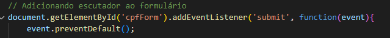

# Validações CPF e Email

### `ÍNDICE`

* [INTRODUÇÃO](#introdução)
* [DESCRIÇÃO](#descrição)
* [VALIDAÇÃO-CPF](#validação-cpf)
* [VALIDAÇÃO-EMAIL](#validação-email)
* [FUNCIONALIDADES](#funcionalidades)
* [RESULTADOS](#resultados)
* [AUTOR-CÓDIGO](#autor-código)

## `INTRODUÇÃO`
    Este trabalho aborda a documentação dos projetos de validação de Email e CPF desenvolvidos em sala de aula utilizando Javascript. A atividade consiste na criação de um repositório no GitHub dedicado à construção dessa documentação detalhada. 

## `DESCRIÇÃO`
    O repositório, denominado "validacoes", servirá como plataforma central para armazenar e versionar os projetos de validação. Após clonar o repositório em seu ambiente local, serão adicionados os arquivos pertinentes aos projetos de validação de CPF e email.
    Ao longo desta atividade, exploraremos os desafios enfrentados, as soluções propostas e os aprendizados adquiridos durante o desenvolvimento desses projetos de validação, contribuindo assim para um entendimento mais profundo sobre práticas de desenvolvimento em Javascript e boas práticas de validação de dados.

(OBS: Partes que estão em verde no código são comentários, utilizado para saber o que cada função faz. Exemplo: )
  

 ## VALIDAÇÃO CPF 

`1º Parte`

 

    Este trecho adiciona um ouvinte de evento ao formulário com o id "cpfForm". Ele captura o evento de submissão (submit) do formulário e previne o comportamento padrão (que seria enviar o formulário para o servidor) usando "event.preventDefault()".

 `2º Parte`

  

    Obtém o valor inserido no campo de entrada de CPF com o id "cpf".

`3º Parte`

    Obtém o elemento onde a mensagem de validação será exibida, que possui o id "message".

`4º Parte`

    Chama a função "validarCPF" passando o valor do CPF obtido do campo de entrada (cpf). Com base no retorno dessa função:
    Se o CPF for válido (validarCPF(cpf) retorna true), define o texto da mensagem como "O CPF é válido!" e estiliza o texto da mensagem como verde.
    Se o CPF não for válido (validarCPF(cpf) retorna false), define o texto da mensagem como "O CPF é inválido!" e estiliza o texto da mensagem como vermelho.

`5º Parte`

    A função "validarCPF" recebe um string cpf, remove caracteres não numéricos, verifica se o CPF tem 11 dígitos e não consiste em dígitos repetidos. Em seguida, calcula os dígitos verificadores do CPF usando a lógica matemática padrão para validação de CPF no Brasil. Se os dígitos verificadores calculados não correspondem aos dígitos fornecidos no CPF, a função retorna "false", indicando que o CPF é inválido. Caso contrário, retorna "true", indicando que o CPF é válido.

## VALIDAÇÃO EMAIL

 `1º Parte` 

 

    Verifica se o valor do campo de email "(document.forms[0].email.value) está vazio ("")" ou se não contém o caractere "@" (indexOf("@") == -1) ou se não contém o caractere "." (indexOf(".") == -1).

`2º Parte` 

    Se alguma das condições acima for verdadeira, exibe um alerta indicando que o usuário deve fornecer um email válido e retorna "false". Isso interrompe a submissão do formulário ou a execução de outras ações que dependam do email ser válido.

`3º Parte`

    Se o e-mail não for válido, um alerta é exibido para o usuário, e a função retorna false, o que normalmente evita que o formulário seja enviado ou processado.

`4º Parte`

    e todas as verificações passarem (ou seja, o e-mail é considerado válido):
    Um alerta informando que o e-mail foi informado com sucesso é exibido.
    O valor do e-mail é então exibido no elemento HTML com o id "email" usando innerHTML.

    O código supõe que o formulário é o primeiro (document.forms[0]), e o campo de e-mail tem o nome "email". Além disso, deve haver um elemento com o id "email" na página HTML.

## `FUNCIONALIDADES`

    Os códigos de validação de CPF e e-mail têm a funcionalidade de garantir que os dados inseridos pelos usuários estejam no formato correto e sejam válidos antes de serem processados ou enviados. Essas validações ajudam a assegurar que os dados fornecidos pelos usuários sejam precisos e estejam em um formato utilizável, evitando erros e problemas no processamento de informações.

## `RESULTADOS`

### CPF

### EMAIL

#### `AUTOR CÓDIGO`

[Leonardo Rocha](https://github.com/LeonardoRochaMarista)

[Manuela Araujo](https://github.com/manuelaaraujo)